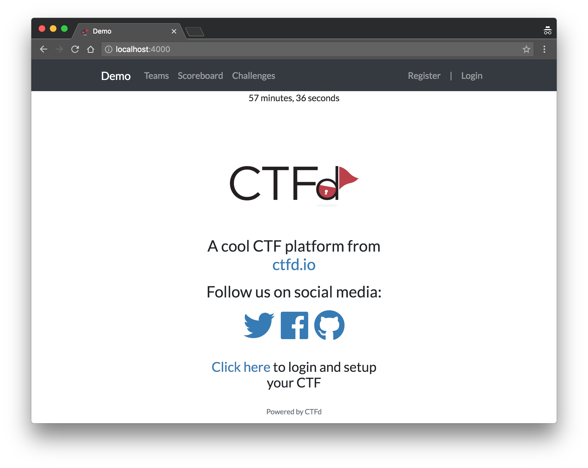

# ctfd-event-countdown
Plugin for CTFd which shows a countdown until the start of the event and then until the end of the event.

## Screenshot




## Install

1. Clone this repository to your CTFd installation under `CTFd/plugins/`.
2. Add to your base template (`themes/core/templates/base.html` if you are using the default theme):
```
    <meta name="start_in" content="{{ ctf_starts_in() }}">
    <meta name="ends_in" content="{{ ctf_ends_in() }}">
```
3. Add `<p class="ctfd-event-countdown">&nbsp;</p>` where you want the countdown to appear.
4. Set an event start or end time in Admin -> Config.
